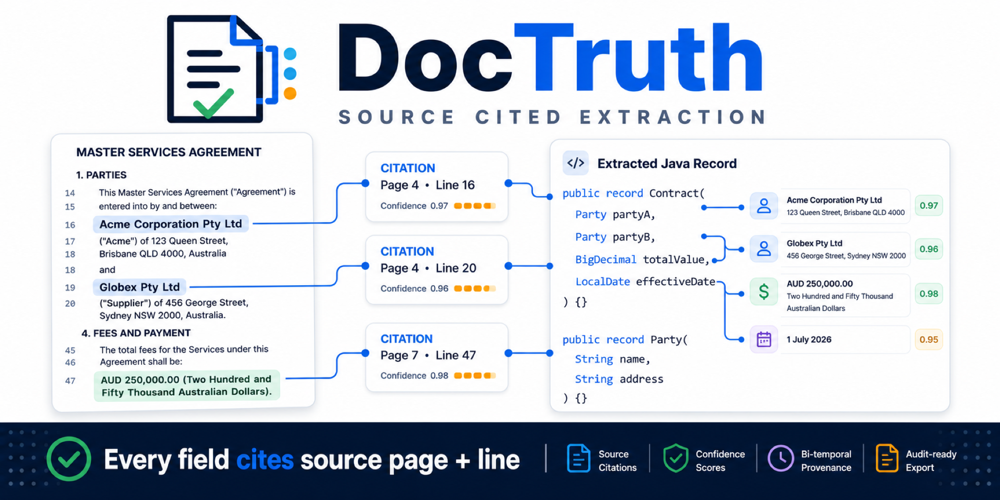
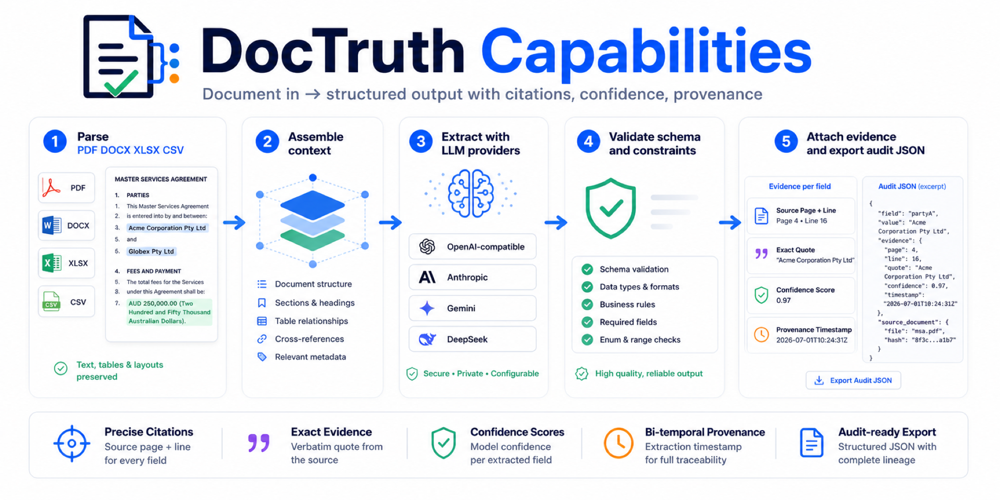

# DocTruth - 面向 Java 的可审计 LLM 抽取

<p align="center">
  
</p>

<p align="center">
  <a href="README.md">English</a> ·
  <a href="README.zh-CN.md">简体中文</a> ·
  <a href="README.zh-TW.md">繁體中文</a> ·
  <a href="README.es.md">Español</a>
</p>

[](https://github.com/doctruthhq/DocTruth/actions)
[](#安装)
[](LICENSE)
[](https://openjdk.org)

**面向 Java 的可审计 LLM 抽取库。** DocTruth 将 PDF、DOCX、XLSX 和 CSV 转成 schema-bound structured output，并为每个字段附上来源引用、可选 PDF bounding box、置信度、provenance 和 PROV-O audit JSON。

DocTruth 主要回答一个问题：

> 这个抽取值从哪里来？

它不是 agent 框架、chain 框架、向量数据库封装，也不是 UI。它只专注于抽取边界：输入源文档，输出经过验证的结构化结果和证据链。

它不绑定框架，可以放进 plain Java、Spring Boot、LangChain4j、Spring AI、Quarkus、Micronaut，或者任何已经在调用 OpenAI、Anthropic、Gemini、DeepSeek 或 OpenAI-compatible endpoint 的 Java 服务。

## 安装

需要 Java 25+。验证 Maven Central 可用：

```bash
mvn dependency:get -Dartifact=ai.doctruth:doctruth-java:0.2.0-alpha
```

在 Maven 项目中使用：

```xml
<dependency>
    <groupId>ai.doctruth</groupId>
    <artifactId>doctruth-java</artifactId>
    <version>0.2.0-alpha</version>
</dependency>
```

Gradle 使用同一个坐标：`ai.doctruth:doctruth-java:0.2.0-alpha`。

升级到最新 release：

```bash
mvn versions:use-latest-releases -Dincludes=ai.doctruth:doctruth-java -DgenerateBackupPoms=false
```

## 快速开始

```java
import ai.doctruth.DocTruth;
import ai.doctruth.OpenAiProvider;
import ai.doctruth.PdfDocumentParser;
import java.math.BigDecimal;
import java.nio.file.Path;
import java.time.LocalDate;

record Contract(String partyA, String partyB, LocalDate effectiveDate, BigDecimal totalValue) {}

var doc = PdfDocumentParser.parse(Path.of("contract.pdf"));

var result = DocTruth.from(new OpenAiProvider(System.getenv("OPENAI_API_KEY")))
        .extract("Extract the contract terms", Contract.class)
        .withProvenance()
        .withConfidence()
        .withBitemporal()
        .run(doc);

Contract contract = result.value();
var partyACitation = result.citations().get("partyA");
```

完整示例见 [`examples/quickstart`](examples/quickstart/)。

## 能力

<p align="center">
  
</p>

- 将 PDF、DOCX、XLSX、CSV 解析成带来源位置的 sections。
- 通过 LLM provider 抽取 Java records 或 JSON Schema 约束的对象。
- 本地验证结构化输出，并对可修复错误自动 retry。
- 将抽取字段匹配回源文档中的精确 quote。
- 返回字段级 `Citation`、`Confidence`、`Provenance`。
- 通过 `toAuditJson(...)` 导出 W3C PROV-O JSON-LD 审计文件。

## JSON Schema 和 Pydantic 互操作

Java record 是原生路径。JSON Schema 是跨语言互操作路径。

```java
var schema = JsonSchema.from(Path.of("contract.schema.json"));

var result = DocTruth.from(provider)
        .extractJson("Extract contract terms", schema)
        .requireCitation("partyA")
        .requireCitation("totalValue")
        .withMaxRetries(2)
        .runJson(doc);
```

DocTruth 支持常见 Pydantic v2 JSON Schema 输出，包括本地 `$defs` / `$ref`、nullable unions、嵌套对象、数组、枚举、required 字段、标量约束和 `additionalProperties=false`。

构建期迁移工具：

```bash
java -jar target/doctruth-java-0.2.0-alpha-all.jar \
  migrate pydantic myapp.schemas:ResumeExtraction \
  -o schemas/resume.schema.json \
  --check
```

生产环境 Java 抽取只需要导出的 schema 文件和 DocTruth jar。

## Provider

OpenAI-compatible chat completions 是主要路径，因为很多托管模型、网关和本地模型都兼容这个 API 形态。

| Provider | 结构化输出方式 |
| --- | --- |
| OpenAI / OpenAI-compatible | `response_format: json_schema` |
| Anthropic | tool-use forcing |
| Gemini | `responseMimeType` + `responseSchema` |
| DeepSeek | OpenAI-compatible JSON mode + 本地验证 |

Provider client 使用 JDK `java.net.http.HttpClient`，不引入 vendor SDK。

## CLI

```bash
mvn package -DskipTests
java -jar target/doctruth-java-0.2.0-alpha-all.jar parse contract.pdf
java -jar target/doctruth-java-0.2.0-alpha-all.jar schema contract.schema.json
java -jar target/doctruth-java-0.2.0-alpha-all.jar extract contract.pdf -s contract.schema.json
```

## 文档

- [Quickstart 示例](examples/quickstart/)
- [Pydantic 互操作示例](examples/pydantic-interop/)
- [架构说明](docs/architecture/auditable-structured-extraction-engine.md)
- [错误处理](docs/error-handling.md)
- [发布流程](docs/release.md)
- [贡献指南](CONTRIBUTING.md)
- [Changelog](CHANGELOG.md)

## 状态

`0.2.0-alpha` 是早期公开 alpha。API 已可用、已测试、可供反馈，但在 `1.0` 前仍可能调整。

当前验证基线：645 个 unit test 和 16 个 integration test 通过，2 个外部 smoke test 跳过，覆盖率门槛为 90% line / 80% branch，单 jar 约 205 KB。

## License

代码使用 [Apache License 2.0](LICENSE)。

`DocTruth`、`doctruth.ai` 和 DocTruth logo 是 doctruthhq 的商标。见 [NOTICE](NOTICE)。
