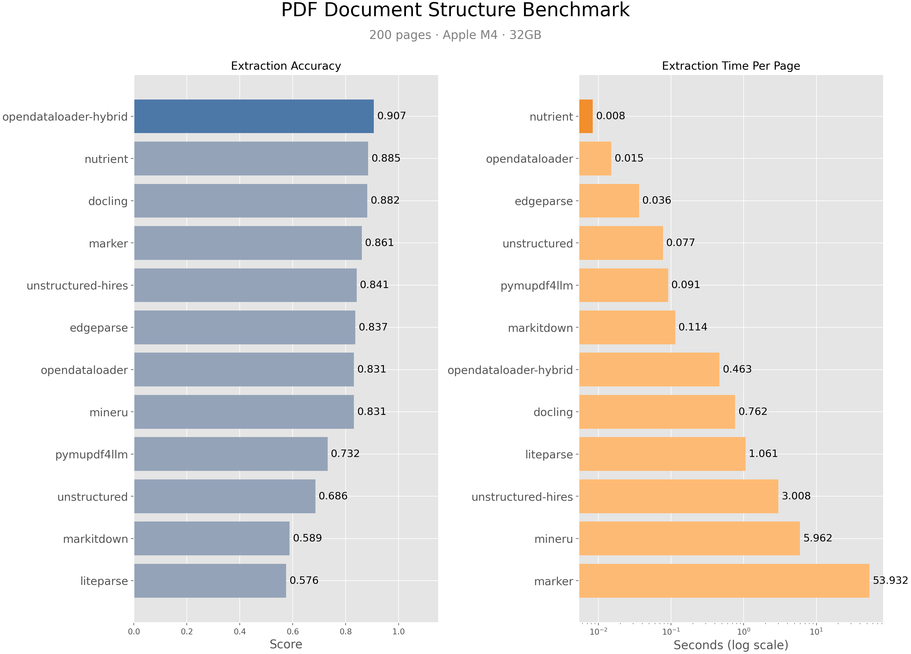
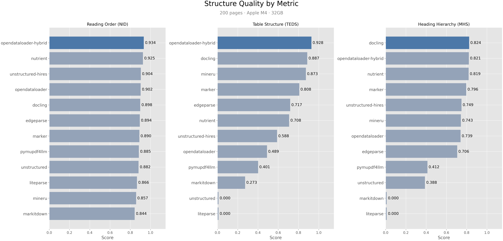

# opendataloader-bench

## 1. About the Project

PDF documents are everywhere, but LLMs can't read them directly. Extracting structured content — headings, tables, reading order — from PDFs is essential for RAG pipelines and document processing workflows.

This benchmark evaluates document structure and layout analysis engines to help you choose the right tool.

**What we measure:**
- **Reading Order** — Is the text extracted in the correct sequence?
- **Table Fidelity** — Are tables accurately reconstructed?
- **Heading Hierarchy** — Is the document structure preserved?

The evaluation pipeline is modular—add new engines, corpora, or metrics with minimal effort.

## 2. Benchmark Results

### Quality Comparison

| Engine                      | Overall   | Reading Order | Table     | Heading   | Speed (s/page) | License     |
|-----------------------------|-----------|---------------|-----------|-----------|----------------|-------------|
| **opendataloader [hybrid]** | **0.907** | **0.934**     | **0.928** | 0.821     | 0.463          | Apache-2.0  |
| nutrient                    | 0.885     | 0.925         | 0.708     | 0.819     | **0.008**      | Commercial  |
| docling                     | 0.882     | 0.898         | 0.887     | **0.824** | 0.762          | MIT         |
| marker                      | 0.861     | 0.890         | 0.808     | 0.796     | 53.932         | GPL-3.0     |
| unstructured [hi_res]       | 0.841     | 0.904         | 0.588     | 0.749     | 3.008          | Apache-2.0  |
| edgeparse                   | 0.837     | 0.894         | 0.717     | 0.706     | 0.036          | Apache-2.0  |
| opendataloader              | 0.831     | 0.902         | 0.489     | 0.739     | 0.015          | Apache-2.0  |
| mineru                      | 0.831     | 0.857         | 0.873     | 0.743     | 5.962          | AGPL-3.0    |
| pymupdf4llm                 | 0.732     | 0.885         | 0.401     | 0.412     | 0.091          | AGPL-3.0    |
| unstructured                | 0.686     | 0.882         | 0.000     | 0.388     | 0.077          | Apache-2.0  |
| markitdown                  | 0.589     | 0.844         | 0.273     | 0.000     | 0.114          | MIT         |
| liteparse                   | 0.576     | 0.866         | 0.000     | 0.000     | 1.061          | Apache-2.0  |

> Scores are normalized to [0, 1]. Higher is better for accuracy metrics; lower is better for speed. **Bold** indicates best performance.

### Visual Comparison





Detailed JSON outputs live alongside each engine and capture the exact metric values:

- [prediction/opendataloader/evaluation.json](prediction/opendataloader/evaluation.json)
- [prediction/opendataloader-hybrid/evaluation.json](prediction/opendataloader-hybrid/evaluation.json)
- [prediction/docling/evaluation.json](prediction/docling/evaluation.json)
- [prediction/marker/evaluation.json](prediction/marker/evaluation.json)
- [prediction/edgeparse/evaluation.json](prediction/edgeparse/evaluation.json)
- [prediction/nutrient/evaluation.json](prediction/nutrient/evaluation.json)
- [prediction/mineru/evaluation.json](prediction/mineru/evaluation.json)
- [prediction/pymupdf4llm/evaluation.json](prediction/pymupdf4llm/evaluation.json)
- [prediction/unstructured/evaluation.json](prediction/unstructured/evaluation.json)
- [prediction/unstructured-hires/evaluation.json](prediction/unstructured-hires/evaluation.json)
- [prediction/markitdown/evaluation.json](prediction/markitdown/evaluation.json)
- [prediction/liteparse/evaluation.json](prediction/liteparse/evaluation.json)

## 3. Metrics

All scores are normalised to the `[0, 1]` range, where higher indicates a closer match to ground truth. Documents missing the artefacts required by a given metric yield `null` in per-document results and are excluded from aggregate means.

### 3.1. Reading Order Similarity (NID, NID-S)

The reading order is evaluated using Normalized Indel Distance (NID), which measures the similarity between the ground truth and predicted text.

$$
NID = 1 - \frac{\text{distance}}{\text{len(gt)} + \text{len(pred)}}
$$

- **NID**: Compares the full extracted text of the prediction against the ground truth.
- **NID-S**: Strips tables before comparison to focus on narrative reading order.

### 3.2. Table Structure Similarity (TEDS, TEDS-S)

Tables are evaluated using Tree Edit Distance Similarity (TEDS), comparing DOM structures with the APTED algorithm.

$$
{TEDS}(T_{\text{gt}}, T_{\text{pred}}) = 1 - \frac{{EditDist}(T_{\text{gt}}, T_{\text{pred}})}{\max(|T_{\text{gt}}|, |T_{\text{pred}}|, 1)}
$$

- **TEDS**: Evaluates both structure and cell text.
- **TEDS-S**: Structure-only, ignoring textual differences (e.g., OCR noise).

### 3.3. Heading-Level Similarity (MHS, MHS-S)

Headings are parsed into a flat list and compared using APTED.

$$
{MHS}(H_{\text{gt}}, H_{\text{pred}}) = 1 - \frac{{EditDist}(H_{\text{gt}}, H_{\text{pred}})}{\max(|H_{\text{gt}}|, |H_{\text{pred}}|, 1)}
$$

- **MHS**: Rewards correctly positioned headings and aligned content blocks.
- **MHS-S**: Structure-only, isolating heading topology.

### 3.4. References

- Z. Chen et al. "MDEval: Evaluating and Enhancing Markdown Awareness in Large Language Models." *arXiv:2501.15000*, 2025.
- X. Zhong et al. "Image-based Table Recognition: Data, Model, and Evaluation." *ECCV Workshops*, 2020.
- M. Pawlik and N. Augsten. "RTED: A Robust Algorithm for the Tree Edit Distance." *arXiv:1201.0230*, 2011.
- Upstage AI. "Document Parsing Benchmark (DP-Bench)." Hugging Face, 2024.

---

## 4. Reproduce the Benchmark

Want to run this benchmark yourself or add a new engine? Follow the steps below.

### Prerequisites

- Python 3.13 or higher
- Git LFS (for PDF files)

### Installation

1. **Clone and set up Git LFS**:
   ```sh
   git clone https://github.com/opendataloader-project/opendataloader-bench
   cd opendataloader-bench
   git lfs install
   git lfs pull
   ```

2. **Install base dependencies** (evaluation + chart generation only):
   ```sh
   uv sync
   ```

3. **Install engine(s) you want to run**:
   ```sh
   # Individual engines
   uv sync --extra opendataloader
   uv sync --extra docling
   uv sync --extra markitdown

   # All permissively-licensed engines at once
   uv sync --extra all-safe
   ```

   AGPL/GPL engines (marker, MinerU, PyMuPDF) and commercial engines (nutrient) are not runnable from this repo — their parser code has been removed to avoid license/commercial-tier entanglement. Their `prediction/` results are preserved so the comparison charts still display them.

   > Don't have uv? See [installation guide](https://docs.astral.sh/uv/getting-started/installation/)

### Running the Benchmark

#### Quality Benchmark (default)

```sh
# Full pipeline: parse → evaluate → archive → chart
uv run src/run.py

# Single engine (skips engines that already have evaluation.json)
uv run src/run.py --engine docling

# Force re-run even if results exist
uv run src/run.py --engine docling --force
```

#### Individual Stages

```sh
# 1. Parse PDFs
uv run src/pdf_parser.py

# 2. Evaluate predictions
uv run src/evaluator.py

# 3. Generate charts (works with existing evaluation.json data only)
uv run src/generate_benchmark_chart.py

# 4. Archive results
uv run src/generate_history.py
```

#### Targeting Specific Engines or Documents

```sh
# Single engine
uv run src/pdf_parser.py --engine opendataloader
uv run src/evaluator.py --engine opendataloader

# Single document
uv run src/pdf_parser.py --doc-id 01030000000001

# Both
uv run src/pdf_parser.py --engine opendataloader --doc-id 01030000000001
```

### Project Structure

```
├─ charts/                 # Generated benchmark charts
├─ ground-truth/           # Reference annotations and structured ground truth
├─ history/                # Archived evaluation results by date
├─ pdfs/                   # Input PDF corpus (200 sample documents)
├─ prediction/             # Engine outputs grouped by engine/markdown
├─ src/                    # Conversion, evaluation, and utility scripts
└─ pyproject.toml          # Python dependencies (uv)
```

## 5. Contributing

### Development Setup

```sh
# After following the installation steps above:
uv sync --dev
```

This installs development dependencies including pytest.

### Running Tests

```sh
uv run pytest
```

### Interpreting `evaluation.json`

Each engine produces an `evaluation.json` with:

- **`summary`**: Engine name/version, hardware info, document count, runtime, date.
- **`metrics.score`**: Mean scores (`overall_mean`, `nid_mean`, `teds_mean`, `mhs_mean`, etc.)
- **`metrics.*_count`**: Number of documents eligible for each metric.
- **`documents`**: Per-document scores and availability flags.

## 6. References

- Z. Chen, Y. Liu, L. Shi, X. Chen, Y. Zhao, and F. Ren. "MDEval: Evaluating and Enhancing Markdown Awareness in Large Language Models." *arXiv preprint arXiv:2501.15000*, 2025. https://arxiv.org/abs/2501.15000
- J. He, M. Rungta, D. Koleczek, A. Sekhon, F. X. Wang, and S. Hasan. "Does Prompt Formatting Have Any Impact on LLM Performance?." *arXiv preprint arXiv:2411.10541*, 2024. https://arxiv.org/abs/2411.10541
- D. Min, N. Hu, R. Jin, N. Lin, J. Chen, Y. Chen, Y. Li, G. Qi, Y. Li, N. Li, and Q. Wang. "Exploring the Impact of Table-to-Text Methods on Augmenting LLM-based Question Answering with Domain Hybrid Data." *arXiv preprint arXiv:2402.12869*, 2024. https://arxiv.org/abs/2402.12869
- M. Pawlik and N. Augsten. "RTED: A Robust Algorithm for the Tree Edit Distance." *arXiv preprint arXiv:1201.0230*, 2011. https://arxiv.org/abs/1201.0230
- Upstage AI. "Document Parsing Benchmark (DP-Bench)." Hugging Face, 2024. https://huggingface.co/datasets/upstage/dp-bench
- X. Zhong, J. Tang, and A. J. Yepes. "Image-based Table Recognition: Data, Model, and Evaluation." *European Conference on Computer Vision Workshops*, 2020. https://arxiv.org/abs/1911.10683
- X. Zhong, J. Tang, and A. J. Yepes. "PubLayNet: largest dataset ever for document layout analysis." *International Conference on Document Analysis and Recognition*, 2019. https://huggingface.co/datasets/jordanparker6/publaynet
